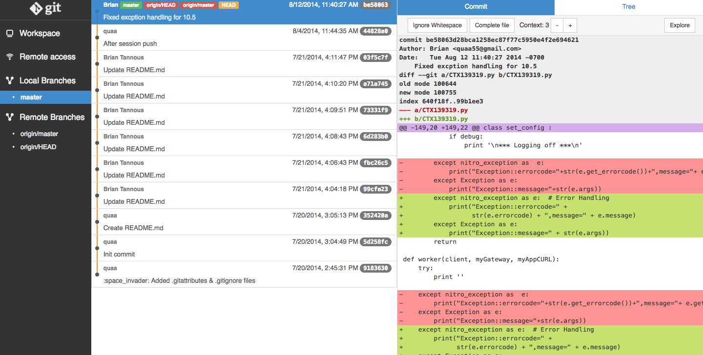

# Overview

This project helps initialize a sandbox environment to develop automation solutions for [NetScaler ADC 12.0](nitro-python-1.0/docs/html/index.html) and [NetScaler MAS 12.0](nitro-python-1.0/doc/index.html) using Nitro API written in Python. 

This project creates a Docker environment for sandboxing and can be deployed as a [single container](#Docker-Run) to interrogate MPX, VPX, and MAS via a [Web based IDE](https://c9.io/) or via a [sandbox environemnt](#Docker-Compose) to interrogate CPX within the defalt Docker network using docker-compose.

# Prerequisits 

1. It is assumed you have installed docker on your machine. If you have not installed docker on your machine, pelase refer to docker's official website to [get started](https://docs.docker.com/engine/installation/)

2. It is required to have a MPX, VPX, or MAS to send API calls to, otherwise use the [docker-compose](#Docker-Compose) method to spin up a CPX on the Docker Network to test your code against NITRO API for an all-in-one solution. 

# Build Docker Image

You can pull the main docker image from [DockerHub](https://hub.docker.com/r/mayankt/nitro-ide/) using the command : 

`sudo docker pull mayankt/nitro-ide`

..or build your own by doing the following: 

```
git clone https://github.com/MayankTahil/nitro-ide.git

sudo docker build -t mayankt/nitro-ide ./nitro-ide
```

You should see the docker image stored locally using the command `sudo docker images`

```
REPOSITORY            TAG         IMAGE ID          CREATED          SIZE
mayankt/nitro-ide    latest     cbd5efd1a833      1 minute ago      982 MB
```

# Run your Docker Image

Simply enter in the following command to run your IDE sandbox environment:

```
sudo docker run -dt --name=nitro-ide -p 9090:80 -p 9091:8000 -v /GitProjects:/workspace --restart=always mayankt/nitro-ide
```

Here is the breakdown of the command from above: 

* `docker run -dt` 
    * This will run the container detached with a terminal in the background

* `--restart=always`
    * This will restart the container automatically if it crashes or when docker/host restart.

* `-p 9090:80` 
    * This will expose port `9090` on the host and map it to port `80` on the contianer for access to [Cloud 9 IDE](https://c9.io/)

* `-p 9091:8000`
    * This will expose port `9091` on the host and mapt it to port `8000` on the container for access to [git webui](https://github.com/alberthier/git-webui) which allows for [repository managemet](#Repository-UI) via the browser.

* `-v /GitProjects:/workspace`
    * **This is an optional Parameter** This will mount the local path on your host at `/Gitprojects` to the local directory within the container at `/workspace`. You can replace the local host directory with any full path on your machine where your projects may be stored. You will be able to edit the same files inside the container via the IDE and locally on your machine if you choose. 

    >If you do not include this parameter, you will working in a ephemeral container which will hold no persistance upon termination. You can run the project without this flag for quick testing and development. Git CLI is already included and the default working directory `/workspace` comes pre-populated with a [NetScaler API tutorial git project](https://github.com/Citrix-TechSpecialist/NetScalerNITRO/tree/cpx-101) to help you get started with some sample code. 

* `mayankt/nitro-ide:latest`
    * This identifies the `latest` tagged image from dockerhub to use when running the container. You can also check out other image [tags](https://hub.docker.com/r/mayankt/nitro-ide/tags/) as this project further develops and accomidates newer versions of NetScaler API's. 

# Compose a Sandbox Environment 

If you are looking for a self contained sandbox to try out NITRO commands via NetScaler's Python SDK, you can compose an environment on your machine with the following containers on the docker network: 

1. [Webserver-A](https://hub.docker.com/r/mayankt/webserver/)
2. [Webserver-B](https://hub.docker.com/r/mayankt/webserver/)
3. [NetScaler CPX](https://www.citrix.com/products/netscaler-adc/cpx-express.html)
4. [Nitro-IDE](https://hub.docker.com/r/mayankt/nitro-ide/)

To use `docker-compose` enter the following on your host machine: 

```
git clone https://github.com/MayankTahil/nitro-ide.git

cd nitro-ide

sudo docker-compose up -d ./docker-compose.yaml
```

To tear down the environment, enter the following commands within the `nitro-ide` folder : 

`sudo docker compose down ./docker-compose.yaml`

> Note: CPX Express does not have all the same features of a traditional VPX/MPX. For example, NITRO commands to configure NetScaler Gateway will fail along with any attempts to automate GLSB configurations.

> Also note that the default username and password for CPX is **root/linux** for ssh access. 

# Accessing your Sandbox

With this environment, you will have potentially two interfaces to work with. 

1. **[Cloud9 IDE](https://github.com/kdelfour/cloud9-docker)**
    * This will be the main text editor and coding environment with Nitro SDKs already pre-installed. 

    * Navigate to `http://localhost:9090` to interact with the IDE interface.

    

2. **[Git Web-UI](https://github.com/alberthier/git-webui)**
    * This git extension is a standalone web based user interface for git repositories. It comes with history and tree browsing. You may also use it to commit as it comes with an UI to review local changes and the ability to stage / unstage code. Moreover, git-webui is also a web server where your repository is accessible to other people on the same network. 

    * To start a web interface for Git, open your browser and navigate to the Cloud9 interface on port 9090. Within the Clou9 terminal located at the bottom pane (press `alt + t` if not already open to display the terminal). Within the terminal, navigate to your git repository (i.e. `cd /workspace/project`) or clone a new project (i.e `git clone https://github.com/Citrix-TechSpecialist/NetScalerNITRO /workspace/NetScalerNITRO ; cd /workspace/NetScalerNITRO`). Within the directory, type : `git webui` and your output should look similar to below : 

      ```
      root@6b74d6ad09dd:/workspace# git clone https://github.com/Citrix-TechSpecialist/NetScalerNITRO.git

      >>

      Cloning into 'NetScalerNITRO'...
      remote: Counting objects: 39, done.
      remote: Compressing objects: 100% (20/20), done.
      remote: Total 39 (delta 18), reused 39 (delta 18), pack-reused 0
      Unpacking objects: 100% (39/39), done.
      Checking connectivity... done.

      >>

      root@6b74d6ad09dd:/workspace# cd NetScalerNITRO/

      >>

      root@6b74d6ad09dd:/workspace/NetScalerNITRO# git webui

      Serving at http://localhost:8000
      ```

    * Now navigate to `http://localhost:9091` to interact with the Git UI interface.

    


# Getting Started

By now you should have a web IDE via Cloud9 to code in with NITRO SDK pre-installed. You can also start a git management UI for projects in your `/workspace` directory. Lets begin by pushing some nitro commands down to our target NetScaler to load balance a simple webserver. 

Assuming you have provisioned a sandbox environment with `docker-compose` you should have the following deployed:

* CPX
  * On the `sandbox` network with an NSIP of `192.168.13.20`
  * Ports `10000` through `10050` open and mapped correspondingly with the host machine
* Two webservers
* Cloud9 IDE for coding

1. Browse to Cloud9's GUI via the browser at `http://localhost:9090` and at the bottom terminal type : `git clone 


